# CrypTable v0.1.0

## Editors

- [Quinn Wilton], [Fission Codes]
- [Brooklyn Zelenka], [Fission Codes]

## Authors

- [Quinn Wilton], [Fission Codes]
- [Brooklyn Zelenka], [Fission Codes]

# Language

The key words "MUST", "MUST NOT", "REQUIRED", "SHALL", "SHALL NOT", "SHOULD", "SHOULD NOT", "RECOMMENDED", "MAY", and "OPTIONAL" in this document are to be interpreted as described in [RFC 2119].

# Abstract

CrypTable is a hierarchically encrypted triple store. It secures data by entity-attribute-value as well as temporally, and comes with efficient random access and diffing.

# 1 Introduction

## 1.1 Motivation

While possible to design a system that can query by any field, all available top-down solutions trade off trust (hexastore, layered range trees) or performance (FHE, SNARK indices). Working with an encrypted database comes with tradeoffs. The naive approach is to encrypt the entire database. While this may be sufficient for simple cases, it forces developers to use separate databases to implement access contol for different users. At the other extreme are [homomorphically encrypted databases], where arbitrary queries may be performed on a fully encryted databases with arbitrary controls, but at the sacrifice of speed and dynamism.

In a [local-first] context, records need to be able to move freely between machines. As such, access control needs to travel with the data itself. This implies that the result of a remote query must include the access control in the resulting records.

## 1.2 Design Goals

- Users manually manage as few keys as possible
- Agnostic to persistence layer
- Use established cryptography
- Efficient seek in large stores
- Minimize network footprint
- Row-level access control
- Range-level access control

## 1.3 Approach

[Triple stores] represent all data ("facts") into entity-attribute-value (EAV) triples. Taken together, these triples may be treated as tables or graphs. This consistent structure is advantageous for granular access control. It is trivial to encrypt a single triple. Extending read-control scope by the entity-attribute-value heirarchy, access to groups of related triples may be granted together at once. 

[Cryptree]s are a well known way of organizing heirarchical encryption. The [Webnative File System][WNFS] (WNFS) is a cryptree, extended with temporal access control.

Once data is retrieved and decrypted, it MAY be indexed locally (e.g. hexastore). 

Cryptable assumes that data will most frequently be granted heirarchically. This is notably often not how data is _accessed_, but does make for a simple mental of what is being shared. It is assumed that in granting access to "everything" about an entity, that this implies all of its fields. For example, granting access to all records with a `name` attribute, or where the value field is set to `Boris` without access to the rest of the entity are less common. As such, favouring the common case for granting read access is reasonable.

CryptTable is a 

- Unlike WNFS's temporal cryptree, a cryptable has a fixed nesting depth

- Scope: read control only; writes are out of scope of THIS spec

The design outlined in this specification MAY be extended by futher splitting data manually across multiple stores.

# 2 Terminology

| Term             | Description                                                 |
|------------------|-------------------------------------------------------------|
| Encrypted Region | Nestable encrypted collecions: stores, entities, attributes |
| Accessible Scope | All of the facts that the viewer is capable of decrypting   |

| Visibility | Layer | Node        | Link                    |
|------------|-------|-------------|-------------------------|
| Decrypted  | File  | WNFS File   | File Path               |
| Decrypted  | Data  | CBOR Object | `NameAccumulator` + Key |
| Encrypted  | Data  | IPLD Block  | CID                     |

# 3 Encryption Geometry[^UnknowableGeometry]

[^UnknowableGeometry]: https://www.youtube.com/watch?v=hEVeBDhWlRw

One of largest challenges with encypting datalog facts is that the access patterns are not known in advance. While it's possible to structure EAV(C) fields as an orthogonal $n$-dimensional tensor, and query in any order, this has major drawbacks in both the cleartext and ciphertext cases. Representing data in this way tends to rely on duplication, indexing, and/or cyclical cross linking. This is not feasible in a Byzantine threat model.

To make the problem tractable, access patterns are broken into two very broad categories which often interact: tabular heirarchy

- Nested, but you can always contruct the pointer to any position in the EAV cube deterministically without doing all of teh intermediate lookups

### 1.2.1 Tabular Heirarchy

For the pruposes of this design, we treat the quad store as a triple store $\langle e, a, \langle v, c \rangle \rangle$.

In reality, each of these relationships is completely orthogonal, but for the pruposes of access control, we simplify the base case to a linear relationship:

This grants the ability to discover and access new enrties in the heirarchy without having to perform a linear table scan.

### 1.2.2 Stream Access

On tables

Needs work:

### 1.2.3 DAG History

History in systems like PomoDB are represented as an acyclic hash graph. 

The most general solution requires local secondary indices (or FHE). Given that these do not match our performance or 

While there are several techniques (k-anonymity, OT) that make it possible to search directly on history,

Reading a CID in the `causedBy` field of a quad MUST NOT immedietly grant access to the entire transative history. Doing so would be potentially dangerous, especially if it crossed between stores. The semantics of the `causedBy` relation do not match that of access control.

While this is an important access pattern in many graph queries, it is not desired for tabular queries. Typically the shape of graph data is more important in queries with a small number of common entities and attributes. Granting access to the entire history of those paths is thus viable.

Instead, the CrypTable ony provides searchable encyprtion via an authentication tag. This is not an HMAC, since the goal is to avoid calculating the unique key for every fact. A cryptographically secure hash function MUST be used, and a nonce based on the combination of the [scoped attribute's hash ID] MUST be concatenated to the cleartext CID before hahsing. This tag MAY be places anywhere on the fact's envelope. When stored in an associative map using this tag as the entry label is RECOMMENDED.
     
If space overhead is a concern, this tag MAY be further anonymized via truncation or XOR folding. Note that this does not increase the k-anonymity as the tag is already indistinguishable from any other tag.

This does leak a small amount of data: if a user does not have the decryption key for some fact, but has a reference to the CID in a fact that they do have access to a successor of (and thus they have the attrbte hash ID), they can discover that the fact's entity and attribute, but not it's value or causal values.

Coupled with the with the attribite tag derivation (e.g. the RSA accumluator in WNFS), scans across the store MAY be performed either strictly linearly with minimal jumps between encrypted regions.

## Padding

Leaking data through length

## Semantic Collison

A field of a particular value MAY be assigned multiple times. 

# 2 Heirarchical Encryption

The tabular heirarchy is as follows:

1. Root
2. Stores 
3. Entities
4. Attributes
5. Values

Note that `causedBy` does not occur in this heirarchy. To have access to a point in history, the usre MUST have access to the relevant fact in the tabular heirarchy.

# 3 Key Derivation

Skip ratchet, but different use from WNFS

A store MUST be seeded with a random nonce of at least 128 bits.

A cryptstore MAY have an unlimited number of levels, but at minimum it MUST contain the following levels:

- StoreRoot
- Entity
- Attribute
- Value

Being granted access to a 

MUST be equipped with a one-way merge function that takes two or more keys and deterministically derives a new value. Concatenating and hashing with SHA2-256 or BLAKE3 is RECOMMENDED.

``` mermaid
flowchart TD
    classDef virtual stroke:#333,stroke-dasharray: 5 5;

    seed --> store:::virtual

    subgraph Virtual
        store --> ent1:::virtual
        ent1 -..-> ent2
        ent1 ~~~ attr1-1:::virtual
        ent1 ----> attr1-1
        ent2 --> attr2-1:::virtual
        ent2 ~~~~ attr1-1
        attr1-1 -.-> attr1-2:::virtual

        val1-1-1:::virtual
        val1-2-1:::virtual
        val1-2-2:::virtual
        val1-2-3:::virtual
        val2-1-1:::virtual
        val2-1-2:::virtual
    end
    
    subgraph Keys ["Derived Keys"]
        key1:::virtual
        key2:::virtual
        key3:::virtual
        key4:::virtual
        key5:::virtual
        key6:::virtual
    end

    attr1-1 --> val1-1-1 --> key1{"🔑1.1.1"} --> val1
    attr1-2 -----> val1-2-1 --> key2{"🔑1.2.1"} --> val2
    val1-2-1 -.-> val1-2-2 --> key3{"🔑1.2.2"} --> val3
    val1-2-2 -.-> val1-2-3 --> key4{"🔑1.2.3"} --> val4

    attr2-1 -------> val2-1-1 --> key5{"🔑2.1.1"} --> val5
    val2-1-1 -.-> val2-1-2 --> key6{"🔑2.1.2"} --> val6

    subgraph Concrete
        val1("(ent1, attr1-1, val1-1-1, [])") --> tag1(tag: a1b)
        val2("(ent1, attr1-2, val1-2-1, [])") --> tag2(tag: 2c3)
        val3("(ent1, attr1-2, val1-2-2, [])") --> tag3(tag: d4e)
        val4("(ent1, attr1-2, val1-2-3, [cidX, cidY])") --> tag4(tag: 5f6)
        val5("(ent2, attr2-1, val2-1-2, [cidX])") --> tag5(tag: g7h)
        val6("(ent2, attr2-1, val2-1-3, [])") --> tag6(tag: 8i9)
    end
```

## 3.1 Vertical Derivation

Derivation of 

## 3.2 Horizonal Derivation

To lock any level to a single version, merge the 

# 4 Tag Derivation

AEAD

# 5 Key Rotation 

also Post COmpromise

# 6 Prior Art

- Skip Ratchet & WNFS

# 7 Acknowledgements

Thanks to [Philipp Krüger][matheus23] for his work on [WNFS]

Many thanks to [Steven Allen] for conversations about WNFS that applied to the

<!-- External Links -->

[HMAC Indexing]: https://soatok.blog/2023/03/01/database-cryptography-fur-the-rest-of-us/#hmac-indexing
[WNFS]: https://github.com/wnfs-wg/
[matheus23]: https://github.com/matheus23
[stebalien]: https://github.com/stebalien

<!-- Internal Links -->
